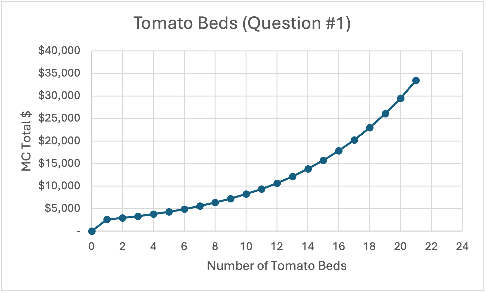

# Perfect Competition — Analysis

## 1. Why tomatoes stop at ~10 beds

Tomatoes make about $8,800 per bed, which is much more than carrots, but the model still plants only 10 tomato beds even though 20 were allowed. They didn't stop because they ran out of space — they stopped because the economics stopped working. At 10 beds, tomato marginal cost is $8,249 and the price is $8,800, so that bed still earns about $551. But at bed 11, marginal cost jumps to $9,391, which is higher than the price. That means any tomato bed past 10 would lose money. Once marginal cost rises above price, the fact that tomatoes are the "money crop" doesn't matter anymore. The model stops at 10 because that's where P = MC switches from profitable to unprofitable, even though 10 more tomato beds were still available.

## 2. Which constraints bind — and what relaxing one is worth

Carrots and mesclun stop because they hit their bed limits while they're still making money, which means the cap — not the economics — is what stops them. For carrots, the farm uses all 20 beds. At bed 20, carrot marginal cost is $1,688.95 and the price is $2,094, so the farm is still earning $405.05 on that bed. If the farm could plant a 21st bed, it would cost $1,741.51 and still earn $352.49. That $352.49 is the shadow price — what one more carrot bed would be worth. Mesclun is the same story. The farm uses all 30 mesclun beds. At bed 30, marginal cost is $2,420.10 and the price is $2,700, leaving $279.90 of room. A 31st bed would cost $2,453.53 and earn $246.47, so $246.47 is mesclun's shadow price. The other limits don't matter: the plan uses only 60 of the 64 total beds and about 3.16 of the 4 temp workers, so those constraints aren't stopping anything. The simple takeaway is that carrot and mesclun land are worth buying first, because each extra bed would add profit, while more total land or more temp labor wouldn't change the plan at all.

## 3. The tomato MC dip at ~6 beds

In the standalone tomato schedule, marginal cost jumps at bed 5 and then drops at bed 6. Bed 5 costs $7,660.86, but bed 6 costs $4,906.28. The dip happens because of a change in who is doing the work, not because tomatoes suddenly get easier to grow. At bed 5, tomatoes are still using almost all of the farmer's expensive hours at $34.72/hr. Only a tiny bit spills over to the cheaper temp labor. By bed 6, the farmer's 720 hours are completely used up, so all of bed 6's labor is priced at the cheaper $17.36/hr temp rate. Even though bed 6 needs more hours than bed 5, the wage drops by half, and that makes the cost fall. After that, every extra hour is at the same temp-labor rate, so nothing else gets cheaper, and diminishing returns push marginal cost back up. The simple lesson is that marginal cost depends on input prices as much as on the number of hours — when the wage changes, the cost curve can dip even while hours per bed keep rising.

## 4. Why grow crops that lose money on their own

Carrots and mesclun look unprofitable when you grow them by themselves because each crop is being forced to carry the whole $20,000 fixed cost alone. In the standalone case, carrot profit is negative at every bed — from about –$19,413 at bed 1 to –$16,488 at bed 20. Mesclun is the same, with losses all the way down to its best point at bed 30 (–$11,922). But in the actual optimal plan, price is above marginal cost for every carrot bed and every mesclun bed. Carrot margins run from $1,120 at bed 1 down to $405 at bed 20, and mesclun stays positive all the way to bed 30. That means each bed earns more than it costs to grow. These crops are planted because the fixed cost is already being paid no matter what — mostly by tomatoes, which earn far more per bed. So the real question isn't whether carrots or mesclun can cover $20,000 on their own, but whether each additional bed earns more than it costs. Since price beats marginal cost everywhere, the answer is yes. This is the short-run shutdown rule: fixed costs are sunk, and as long as P ≥ MC, it makes sense to produce even if the crop looks unprofitable when run alone.

## Against the Stage 1 hypothesis

In Stage 1, I predicted 6 tomato, 20 carrot, and 24 mesclun beds. Carrots were the one part I got exactly right — they stay cheap to grow and never come close to their price, so taking the full 20-bed cap was correct. Tomatoes were a directionally right but size-wrong prediction. I expected them to stop early because their diminishing returns are steep, and that part is true, but I underestimated how much room their high $8,800 price gives them. Their MC curve starts low enough that it doesn't cross price until bed 11, so the model planted 10 instead of 6. Mesclun was a different mistake entirely. I stopped at 24 out of caution, but mesclun's marginal cost never gets close to its $2,700 price — even one bed past the cap. Nothing in the economics justified stopping early, so the model went all the way to 30. Carrots were right for the right reason; tomatoes were right in direction but wrong in magnitude; mesclun was a pure judgment miss from not checking where MC meets price.
