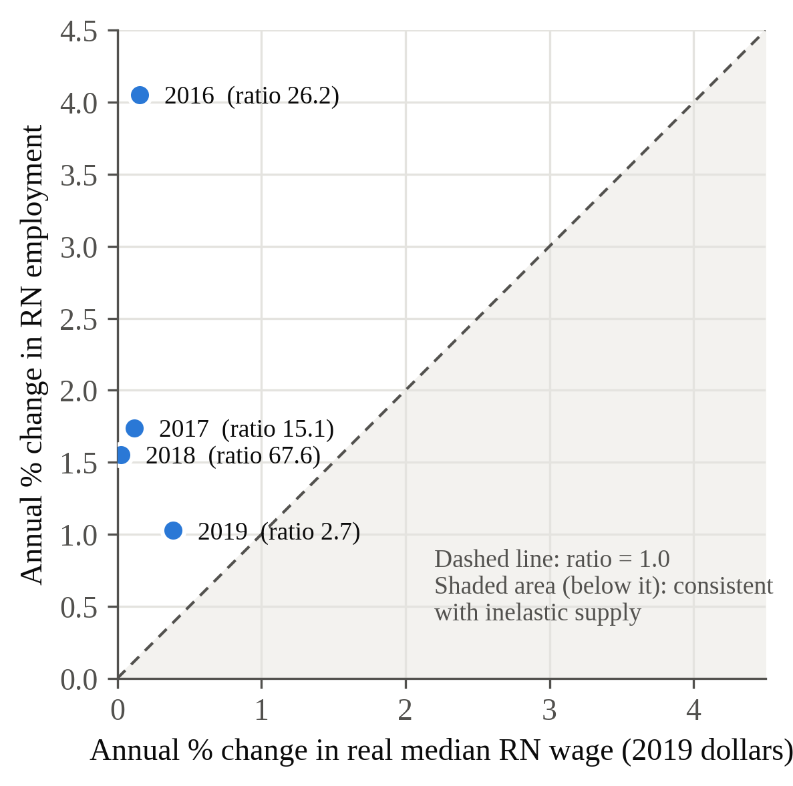
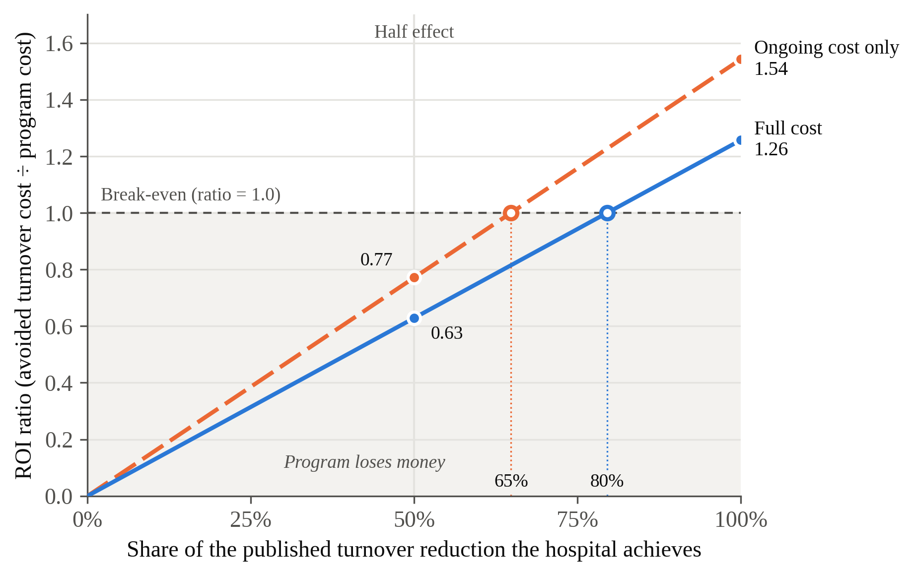

# Under What Conditions Does a Nurse Residency Program Generate a Positive Return on Investment for a U.S. Nonprofit Community Hospital Facing Ongoing Nurse Turnover Costs?

Ethel Sumibcay
BUS-620: Individual Research Paper
October 9, 2026

*Draft 1*

---

## The Challenge

A U.S. nonprofit community hospital with about 490 registered nurses (RNs) loses roughly 86 nurses each year. At the 2025 national staff RN turnover rate of 17.6%, and with each departure costing an average of $60,090 to replace, turnover costs the hospital about $5.2 million annually in recruitment, onboarding, overtime, and temporary staffing (NSI, 2026). Turnover also affects patient outcomes. Aiken et al. (2002) found that each additional patient assigned to a nurse was associated with 7% higher odds of death within 30 days of admission.

This paper is written for the hospital's chief financial officer (CFO), who must decide whether investing in a nurse residency program for newly graduated RNs is financially worthwhile. The hospital is sized to match the average hospital reported by NSI ($294,976 per point of turnover ÷ $60,090 per departure ≈ 490 RNs). The central question is simple: under what conditions does the program save more money than it costs? To answer that question, the analysis examines three links: (1) whether RN supply is inelastic, (2) what turnover costs the hospital, and (3) whether the residency program pays for itself. Each link is evaluated against criteria established before the data were analyzed.

## Is RN Supply Inelastic?

One reason hospitals invest in retention is the belief that increasing wages alone will not solve nursing shortages. If RN supply is inelastic, higher pay brings relatively few additional nurses into the workforce, making it more important for hospitals to keep the nurses they already have.

To test this idea, I calculated an observed employment-wage ratio by dividing the percentage change in RN employment by the percentage change in the real median RN wage between May 2015 and May 2019 (BLS OEWS data adjusted using CPI-U). A ratio below 1.0 would be consistent with inelastic supply. Instead, RN employment increased by 8.6% while the real median wage increased by only 0.7%, producing a ratio of approximately 12.7. Every year-to-year change during the period was also above 1.0 (Figure 1).

Based on the threshold established before the analysis, this link failed. The result does not support the claim that RN supply was inelastic during this period. A more likely explanation is that both supply and demand changed at the same time. Demand for nurses grew as the population aged and patient needs became more complex, while supply increased through expanded nursing-school capacity and new graduate entry into the profession. Because this measure cannot separate those two effects, it cannot determine whether RN supply is truly elastic or inelastic.

Although Link 1 was not supported, that does not change the hospital's financial problem. Hospitals still face substantial turnover costs. For the CFO, the more important question is not whether nurse supply is inelastic, but whether reducing turnover saves more money than it costs.

## What Turnover Costs This Hospital

NSI reports staff RN turnover rates of 18.4% in 2023, 16.4% in 2024, and 17.6% in 2025 (NSI, 2026). The pre-set test required turnover to increase by at least one percentage point over the period. Instead, turnover fell by 0.8 percentage points, so this link was not supported. However, the financial case for a nurse residency program depends on the level of turnover, not its trend. At a turnover rate of 17.6%, a hospital with approximately 490 RNs still loses about 86 nurses per year, costing roughly $5.2 million annually in replacement expenses. Given those costs, even modest reductions in turnover could generate meaningful savings.

## Does the Residency Program Pay?

The program evaluated in this paper is the new-graduate transition-to-practice residency studied by Silvestre et al. (2017). In a randomized controlled trial involving 1,032 new graduate nurses across 70 hospitals, turnover after 12 months was 15.5% for nurses in the residency program compared with 26.8% for those who did not participate, a reduction of 11.3 percentage points. The program cost $3,908 per new graduate in 2013 dollars, including both ongoing operating costs and one-time development costs. I selected this program because it is one of the few retention strategies with both a published cost and a measurable effect on turnover.

To estimate what the program would mean for the case hospital, I applied the study's results to a hospital hiring 15 new graduate nurses per year, the average reported by Silvestre et al. (2017). An 11.3 percentage-point reduction in turnover would prevent about 1.7 departures annually. At NSI's estimated replacement cost of $60,090 per nurse, that translates to approximately $101,853 in avoided turnover costs. After adjusting program costs to 2025 dollars using CPI-U, the program would cost about $81,012 in total, or $66,024 if the hospital adopted an existing program and paid only ongoing costs.

*Table 1. Return on investment (avoided turnover cost ÷ program cost)*

| Cost basis | Full effect | Half effect | Break-even share |
|---|---|---|---|
| Full cost ($81,012) | 1.26 | 0.63 | ~80% |
| Ongoing cost only ($66,024) | 1.54 | 0.77 | ~65% |

Using the published effect, the program generates a positive return on investment. However, when the effect is reduced by half, the ROI falls below break-even on both cost bases. This means the program pays for itself only if the hospital achieves most of the turnover reduction reported in the original study. In other words, the decision to fund the program depends less on the published average result and more on whether the hospital can implement the program successfully enough to achieve similar outcomes.

## Recommendation to the CFO

Based on these results, I recommend funding the nurse residency program only if the hospital can reasonably expect to achieve most of the turnover reduction reported by Silvestre et al. (2017). The best way to improve the chances of success is to adopt an established program and implement it as designed. The hospital should track first-year new-graduate turnover and review results after 12 months to determine whether the program is producing the expected return. If turnover reductions fall substantially short of expectations, the program should be reevaluated before additional resources are committed.

Even if successful, the residency program prevents only about two of the hospital's roughly 86 annual RN departures because it affects only the 15 new graduates hired each year. It should therefore be viewed as one part of a broader retention strategy rather than a complete solution to turnover.

## Conclusion

The first two links in this analysis were not supported by the data. However, turnover remained costly, and the nurse residency program generated a positive ROI under the published effect. The evidence therefore supports funding the program only if the hospital can reasonably expect to achieve most of the turnover reduction reported by Silvestre et al. (2017).

---

## Figures

**Figure 1.** Annual % change in RN employment vs. annual % change in real median RN wage, May 2016–May 2019. Every point lies above the ratio = 1.0 line; the full-period ratio (2015–2019) is about 12.7. Sources: BLS OEWS; BLS CPI-U.

**Figure 2.** Return on a nurse residency program for a 490-RN hospital, by share of the published turnover reduction achieved. Above 1.0 the program pays for itself. Sources: Silvestre et al. (2017); NSI (2026); BLS CPI-U.

---

## References

Aiken, L. H., Clarke, S. P., Sloane, D. M., Sochalski, J., & Silber, J. H. (2002). Hospital nurse staffing and patient mortality, nurse burnout, and job dissatisfaction. *JAMA, 288*(16), 1987–1993. https://doi.org/10.1001/jama.288.16.1987

NSI Nursing Solutions, Inc. (2026). *2026 NSI national health care retention & RN staffing report*. NSI Nursing Solutions.

Silvestre, J. H., Ulrich, B. T., Johnson, T., Spector, N., & Blegen, M. A. (2017). A multisite study on a new graduate registered nurse transition to practice program: Return on investment. *Nursing Economic$, 35*(3), 110–118.

U.S. Bureau of Labor Statistics. (2016–2020). *Occupational employment and wage statistics: Registered nurses (29-1141), May 2015–May 2019* [Data set]. U.S. Department of Labor.

U.S. Bureau of Labor Statistics. (2026). *Consumer price index for all urban consumers (CPI-U): U.S. city average, all items* [Data set]. U.S. Department of Labor.

---

## Appendix A: ROI Bridge

| Step | Calculation | Result |
|---|---|---|
| New-graduate hires per year | Silvestre et al. (2017) mean | 15 |
| Turnover reduction | 26.8% − 15.5% | 11.3 points |
| Departures avoided | 15 × 0.113 | 1.695 |
| Turnover cost avoided | 1.695 × $60,090 | $101,853 |
| CPI-U adjustment, 2013 → 2025 | 321.943 ÷ 232.957 | 1.382 |
| Program cost, full | 15 × $3,908 × 1.382 | $81,012 |
| Program cost, ongoing only | 15 × $3,185 × 1.382 | $66,024 |
| ROI, full cost | $101,853 ÷ $81,012 | 1.26 |
| ROI, ongoing cost only | $101,853 ÷ $66,024 | 1.54 |
| Break-even share, full cost | $81,012 ÷ $101,853 | 79.5% |
| Break-even share, ongoing only | $66,024 ÷ $101,853 | 64.8% |
